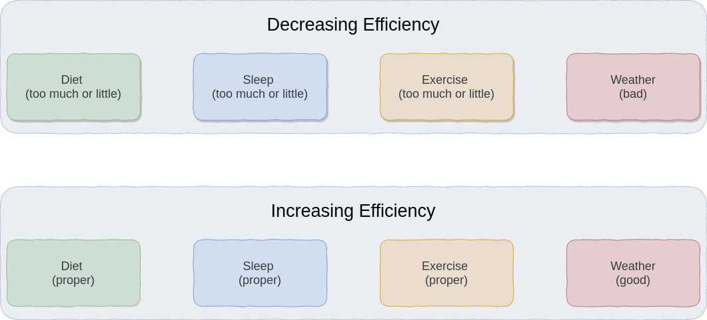
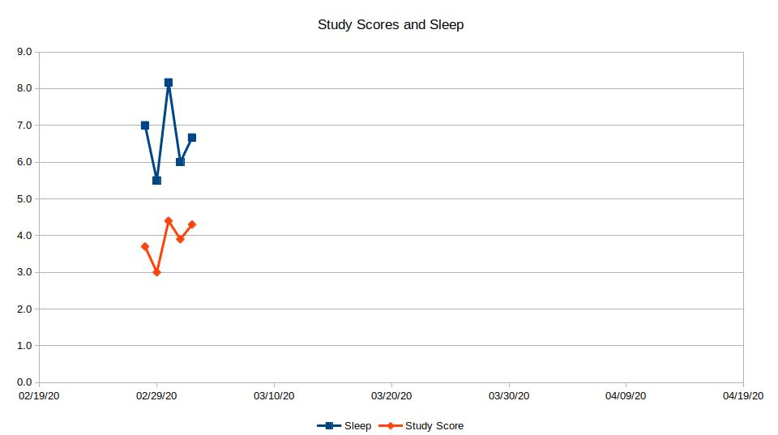
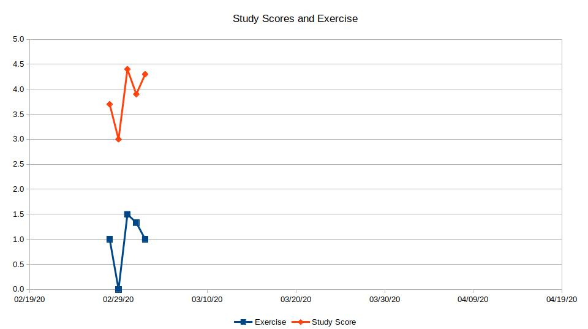
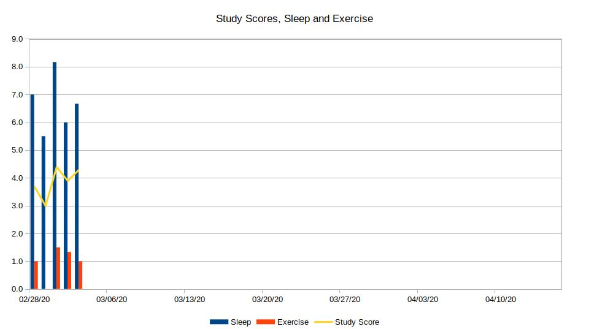

# PHASE 1: Planning
## Project Title:
> Increasing Efficiency In Studying
## Project Core Inquiry:
> Can I get motivated in studying and improve the efficiency by improving diet, sleep and exercise?
## Project Rationale:
> Studying is the most important part in my current life. Sometimes, I can't finished my studying schedule due to my poor efficiency in studying. So I decided to do a data visualization of my daily study at 14:00 - 17:00 along with my daily diet, sleep and exercise. Finally, I will find out if improving diet, sleep and exercise can motivate my daily study.
## Project Hypothesis:  
> I can get motivated in studying by improving diet, sleep and exercise in a proper way. However, other factors such as weather condition might affect the result.
## Cause-Outcome Relationship Diagram:
> Diet, sleep, exercise and even weather conditions will trigger the outcome. In addition, the frequency and the level of these events can affect results as well.
> 
## Identify Varibles:
> I would like to track my real study time from 14:00 to 17:00 along with daily sleep and exercise
## Visualization Sample:
> Visulization Sample: Study and Sleep
> 
> Visulization Sample: Study and Exercise
>  
> Visulization Sample: Study, Sleep and Exercise
> 

