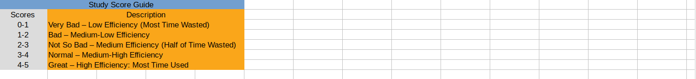

# PHASE 2: Tool Building
## Identify Subjective Component:
> I identify the efficiency of studying as Study Score by counting study time and finished pencentage of total work
## Create Spreadsheet and Score Scale:
> 
## Study Scores Guide:
> 
## Study Finished Level Scores Guide:
> 
## Third Party Tracking Measurement:
> I found that the weather condition might affect my daily emotion. So I decided to use public weather report api to get daily weather condition like temperature.
> 
> 
## Data Gathering Tool
> 

