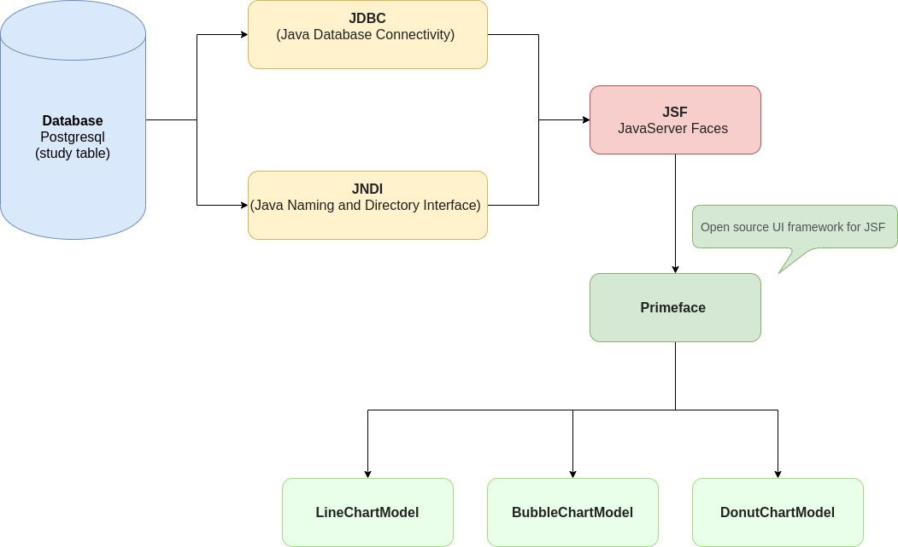
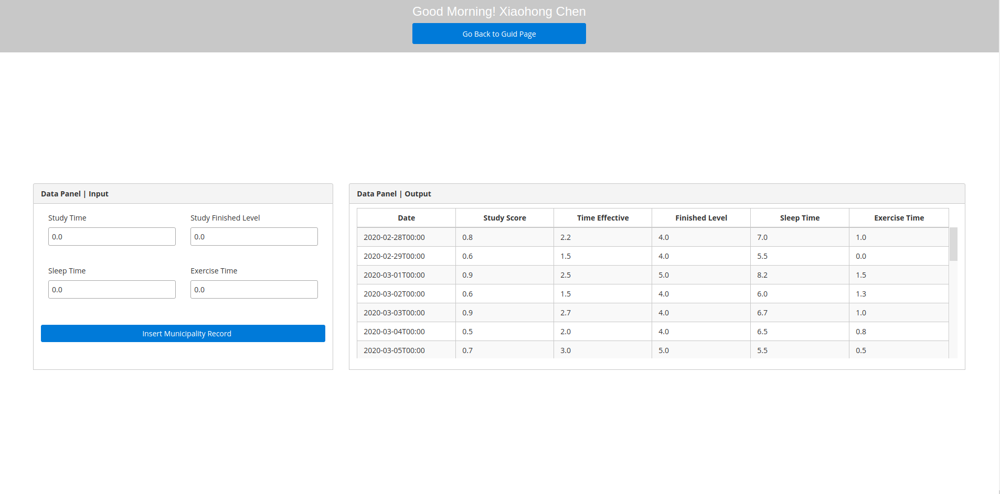
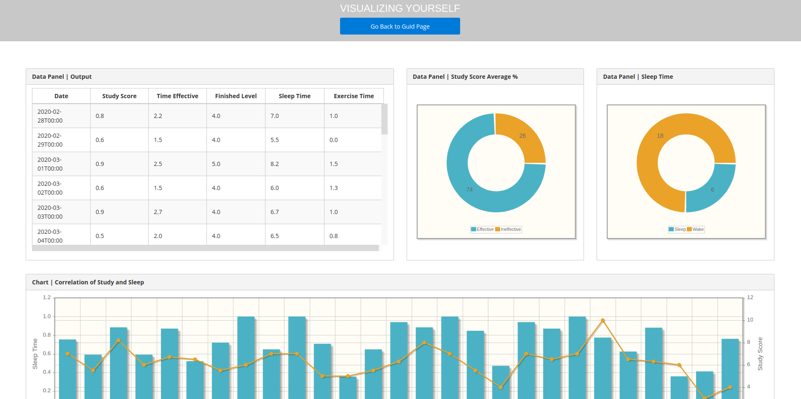
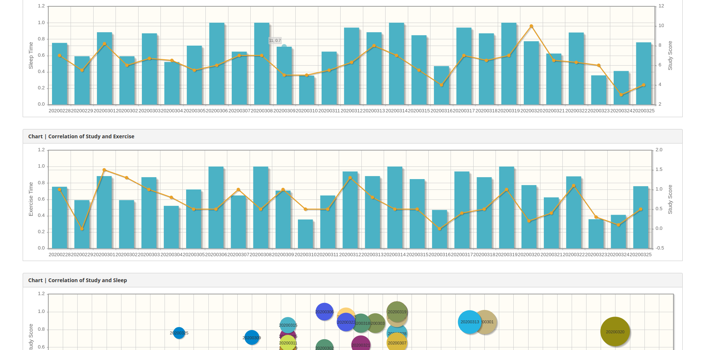
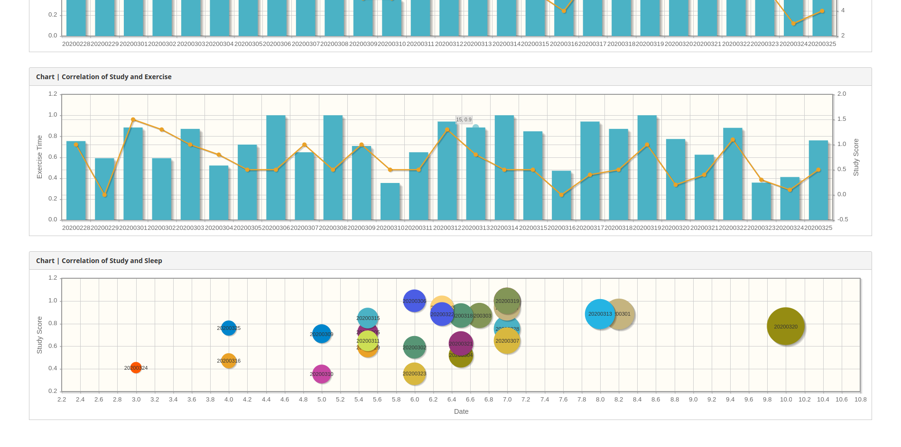

# PHASE 7: Final-Implementation
## Question:
#### Can I get motivated in studying and improve the efficiency by improving diet, sleep and exercise?
## Tool Chain
> 
## Start Page:
> 
## Guide Page:
> 
## Recording Page:
> 
## Visualizing Page:
### Pie Chart:
> 
### Histogram Chart:
> 
### Bubble Chart:
> 

